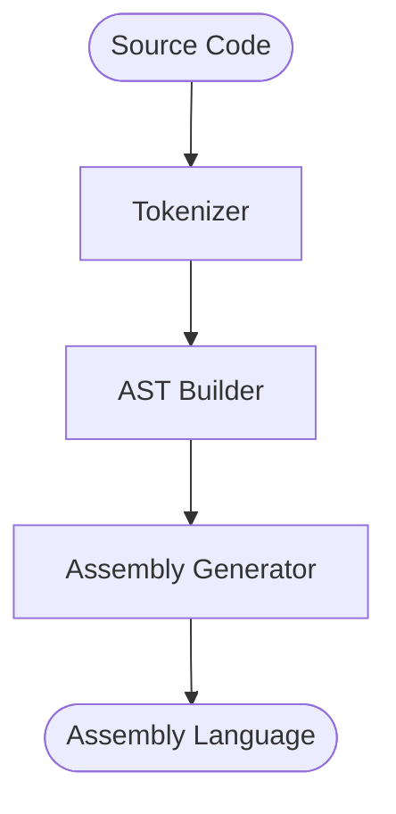

# dynamite-compiler

Compiler for a language with syntax similar to the C language, written in Rust

## Architecture

This program adopts pipeline architecture and processes source code as input in the flow depicted in the diagram below, resulting in assembly language output.

